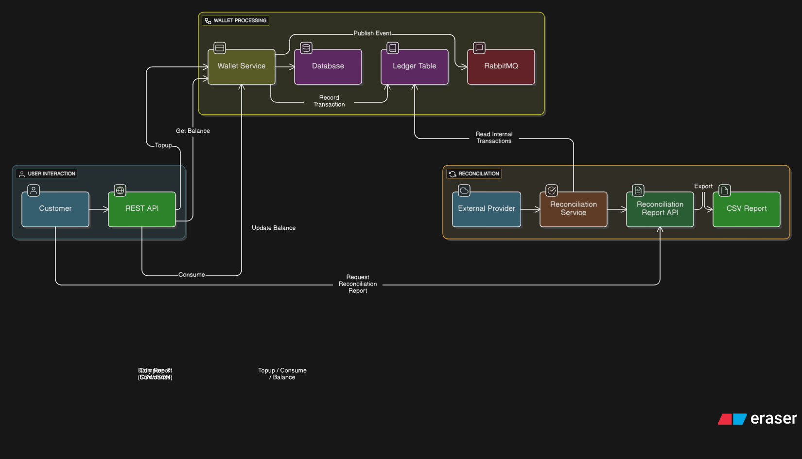

# Wallet & Settlement Service

A microservice for managing customer wallet balances and performing daily reconciliation with external transaction reports.

## Features

- Customer wallet management (top-up, consume, balance inquiry)
- Transaction ledger with RabbitMQ messaging
- Daily reconciliation with external transaction reports
- CSV export of reconciliation reports
- Docker containerization
- Comprehensive testing

## Architecture



## Quick Start

### Prerequisites
- Java 21+
- Maven 3.8.8+
- Docker & Docker Compose

### Running with Docker

```bash
# Navigate to the project root
cd /path/to/wallet_settlement

# Build the application (skips tests to speed up Docker build)
mvn clean package -DskipTests

# Bring down any existing containers and volumes, then rebuild and start all services
docker compose down -v && docker compose up --build -d

# Check application logs for startup status
docker compose logs -f wallet-app
```

After startup, the application will be available at:
- API & Swagger UI: http://localhost:8080 (Swagger UI at `/swagger-ui.html`)
- RabbitMQ Management: http://localhost:15672 (guest/guest)

### Local Development

```bash
# Navigate to the project root
cd /path/to/wallet_settlement

# Start only the PostgreSQL and RabbitMQ dependencies
docker compose up postgres rabbitmq -d

# Run the Spring Boot application locally
mvn spring-boot:run
```

## API Endpoints

All API endpoints are documented and interactive via Swagger UI: `http://localhost:8080/swagger-ui.html`. Key endpoints include:

- **Wallet Operations**: Create, top-up, consume, and get balance for customer wallets.
- **Reconciliation Operations**: Process external transaction reports (CSV/JSON), get reconciliation reports, and export reports to CSV.

## Detailed Testing Guide

This guide provides a step-by-step process for testing all endpoints, including the reconciliation module, and observing RabbitMQ behavior for end-to-end verification.

**Prerequisites:**

*   Ensure your Docker containers are running:
    ```bash
    docker compose up -d
    ```
*   Your database should be clean (e.g., after running `docker compose down -v` and `docker compose up -d`).
*   Open your browser to the Swagger UI: `http://localhost:8080/swagger-ui.html`
*   Open another browser tab for RabbitMQ Management UI: `http://localhost:15672` (login with `guest`/`guest`)

---

### **Phase 1: Testing Wallet Endpoints and Observing RabbitMQ**

This phase will simulate creating internal transactions, which are necessary for reconciliation.

1.  **Create a Wallet (CUST_TEST_001):**
    ```bash
    curl -X POST http://localhost:8080/api/v1/wallets -H "Content-Type: application/json" -d '{ "customerId": "CUST_TEST_001" }'
    ```
    **Expected Response:** `{"customerId": "CUST_TEST_001", "balance": 0.00}`

2.  **Top Up Wallet (CUST_TEST_001):**
    ```bash
    curl -X POST http://localhost:8080/api/v1/wallets/CUST_TEST_001/topup -H "Content-Type: application/json" -d '{ "amount": 100.00, "description": "First top-up", "requestId": "CUST_TEST_001_TOPUP_1" }'
    ```
    **Expected Response:** `{"transactionId": "UUID-OF-TOPUP-TXN", "type": "TOPUP", "amount": 100.00, "description": "First top-up", "status": "COMPLETED"}`
    **Observe RabbitMQ:** Check `http://localhost:15672/#/queues` for `transactionQueue` activity. Messages should briefly appear and then be consumed.

3.  **Consume from Wallet (CUST_TEST_001):**
    ```bash
    curl -X POST http://localhost:8080/api/v1/wallets/CUST_TEST_001/consume -H "Content-Type: application/json" -d '{ "amount": 50.00, "description": "First consume", "requestId": "CUST_TEST_001_CONSUME_1" }'
    ```
    **Expected Response:** `{"transactionId": "UUID-OF-CONSUME-TXN", "type": "CONSUME", "amount": 50.00, "description": "First consume", "status": "COMPLETED"}`
    **Observe RabbitMQ:** Repeat RabbitMQ observation.

4.  **Get Wallet Balance (CUST_TEST_001):**
    ```bash
    curl -X GET http://localhost:8080/api/v1/wallets/CUST_TEST_001/balance
    ```
    **Expected Response:** `{"customerId": "CUST_TEST_001", "balance": 50.00}`

5.  **Get Wallet Transactions (CUST_TEST_001):**
    ```bash
    curl -X GET http://localhost:8080/api/v1/wallets/CUST_TEST_001/transactions
    ```
    **Expected Response:** A list of transactions for `CUST_TEST_001` with `status: COMPLETED`.

**Note:** Repeat steps for other customer IDs to generate more internal transactions for reconciliation. Ensure all transactions are for the same date you plan to reconcile, e.g., **2025-08-28**.

---

### **Phase 2: Testing Reconciliation Endpoints**

Now that you have internal transactions, let\'s reconcile them.

**Assumption for External Report Structure and Reconciliation Strategy:**

Our reconciliation module assumes that the internal and external transaction IDs may not directly match. Instead, reconciliation is performed by comparing a composite key derived from several fields: `customer_id`, `type`, `transaction_date`, and `amount`.

**External CSV Report Structure (`transactions.csv`):**
```csv
external_transaction_id,amount,customer_id,type,transaction_date
EXT-TXN-A,100.00,CUST_TEST_001,TOPUP,2025-08-28
EXT-TXN-B,50.00,CUST_TEST_001,CONSUME,2025-08-28
EXT-TXN-C,200.00,CUST_TEST_002,TOPUP,2025-08-28
EXT-TXN-D,75.00,CUST_TEST_002,CONSUME,2025-08-28
EXT-TXN-E,120.00,CUST_NON_EXISTENT,TOPUP,2025-08-28
```
*   **Remember to replace `YYYY-MM-DD` with `2025-08-28`!** Save this as `/home/champez/Downloads/transactions.csv`.

**External JSON Report Structure (`transactions.json`):**
```json
[
  {
    "externalTransactionId": "EXT-JSON-A",
    "amount": 100.00,
    "customerId": "CUST_TEST_001",
    "type": "TOPUP",
    "transactionDate": "2025-08-28"
  },
  {
    "externalTransactionId": "EXT-JSON-B",
    "amount": 50.00,
    "customerId": "CUST_TEST_001",
    "type": "CONSUME",
    "transactionDate": "2025-08-28"
  }
]
```
Save this as `/home/champez/Downloads/transactions.json`.

**Testing Reconciliation Endpoints:**

1.  **Process External Report (CSV):**
    ```bash
    curl -X POST "http://localhost:8080/api/v1/reconciliation/process?date=2025-08-28" \
         -H "Content-Type: multipart/form-data" \
         -F "file=@/home/champez/Downloads/transactions.csv;type=text/csv"
    ```
    **Expected Response:** `Reconciliation processed successfully for date: 2025-08-28`

2.  **Process External Report (JSON):**
    **Note:** For a clean test, restart Docker containers (`docker compose down -v && docker compose up --build -d`) and re-populate wallets/transactions before running this.
    ```bash
    curl -X POST "http://localhost:8080/api/v1/reconciliation/process?date=2025-08-28" \
         -H "Content-Type: multipart/form-data" \
         -F "file=@/home/champez/Downloads/transactions.json;type=application/json"
    ```
    **Expected Response:** `Reconciliation processed successfully for date: 2025-08-28`

3.  **Get Reconciliation Report:**
    ```bash
    curl -X GET "http://localhost:8080/api/v1/reconciliation/report?date=2025-08-28"
    ```
    **Expected Response (example):**
    ```json
    {
      "date": "2025-08-28",
      "summary": {
        "totalTransactions": 5,
        "matched": 3,
        "mismatched": 2,
        "totalAmount": 1000.00,
        "matchedAmount": 850.00,
        "discrepancyAmount": 150.00
      },
      "discrepancies": [
        {
          "reconciliationId": "UUID-OF-DISCREPANCY-1",
          "reconciliationDate": "2025-08-28",
          "internalTransactionId": null,
          "externalTransactionId": "EXT-4",
          "internalAmount": null,
          "externalAmount": 999.99,
          "discrepancyAmount": null,
          "discrepancyReason": "External transaction not found in internal records",
          "status": "MISSING_INTERNAL"
        }
      ]
    }
    ```

4.  **Export Reconciliation to CSV:**
    ```bash
    curl -X GET "http://localhost:8080/api/v1/reconciliation/export?date=2025-08-28" -o reconciliation_report_2025-08-28.csv
    ```
    **Expected:** A CSV file download named `reconciliation_report_2025-08-28.csv`.

---

## Test Data

### Sample API Requests
*   **Create Wallet**: `curl -X POST http://localhost:8080/api/v1/wallets -H "Content-Type: application/json" -d '{"customerId": "CUSTOMER001"}'`
*   **Top Up Wallet**: `curl -X POST http://localhost:8080/api/v1/wallets/CUSTOMER001/topup -H "Content-Type: application/json" -d '{"amount": 500.00, "description": "Initial funding", "requestId": "CUSTOMER001_TOPUP_1"}'`
*   **Consume from Wallet**: `curl -X POST http://localhost:8080/api/v1/wallets/CUSTOMER001/consume -H "Content-Type: application/json" -d '{"amount": 75.00, "description": "Credit score check", "requestId": "CUSTOMER001_CONSUME_1"}'`
*   **Get Wallet Balance**: `curl -X GET http://localhost:8080/api/v1/wallets/CUSTOMER001/balance`

**Example Multiple Transactions:**
```bash
# Customer A
curl -X POST http://localhost:8080/api/v1/wallets -H "Content-Type: application/json" -d '{ "customerId": "CUST_A" }'
curl -X POST http://localhost:8080/api/v1/wallets/CUST_A/topup -H "Content-Type: application/json" -d '{"amount": 1000.00, "description": "Initial deposit", "requestId": "CUST_A_TOPUP_1"}'
curl -X POST http://localhost:8080/api/v1/wallets/CUST_A/consume -H "Content-Type: application/json" -d '{"amount": 150.00, "description": "KYC verification", "requestId": "CUST_A_CONSUME_1"}'
curl -X POST http://localhost:8080/api/v1/wallets/CUST_A/consume -H "Content-Type: application/json" -d '{"amount": 200.00, "description": "Credit scoring", "requestId": "CUST_A_CONSUME_2"}'

# Customer B
curl -X POST http://localhost:8080/api/v1/wallets -H "Content-Type: application/json" -d '{ "customerId": "CUST_B" }'
curl -X POST http://localhost:8080/api/v1/wallets/CUST_B/topup -H "Content-Type: application/json" -d '{"amount": 750.00, "description": "Account funding", "requestId": "CUST_B_TOPUP_1"}'
curl -X POST http://localhost:8080/api/v1/wallets/CUST_B/consume -H "Content-Type: application/json" -d '{"amount": 85.00, "description": "Document verification", "requestId": "CUST_B_CONSUME_1"}'

# Customer C
curl -X POST http://localhost:8080/api/v1/wallets -H "Content-Type: application/json" -d '{ "customerId": "CUST_C" }'
curl -X POST http://localhost:8080/api/v1/wallets/CUST_C/topup -H "Content-Type: application/json" -d '{"amount": 300.00, "description": "Top up", "requestId": "CUST_C_TOPUP_1"}'
curl -X POST http://localhost:8080/api/v1/wallets/CUST_C/consume -H "Content-Type: application/json" -d '{"amount": 120.00, "description": "CRB check", "requestId": "CUST_C_CONSUME_1"}'
```

---

## Testing

```bash
# Run unit tests
mvn test

# Run integration tests
mvn test -Dtest=*IntegrationTest

# Run all tests with coverage
mvn clean test jacoco:report
```

## Database Schema

### Wallet Table
- `id` (Primary Key)
- `customer_id` (Unique)
- `balance` (Decimal 19,2)
- `version` (Optimistic Locking)
- `created_at`, `updated_at`

### Transaction Table
- `id` (Primary Key)
- `transaction_id` (Unique)
- `request_id` (Unique, for idempotency)
- `wallet_id` (Foreign Key)
- `type` (TOPUP/CONSUME)
- `amount` (Decimal 19,2)
- `description`, `status`, `created_at`

### Reconciliation Record Table
- `id` (Primary Key)
- `reconciliation_date`
- `reconciliation_id`
- `internal_transaction_id`
- `external_transaction_id`
- `internal_amount`, `external_amount`
- `discrepancy_amount`
- `discrepancy_reason`
- `status` (MATCHED/MISSING_INTERNAL/MISSING_EXTERNAL/AMOUNT_MISMATCH)

## Configuration

Key application properties:
- `server.port`: Application port (default: 8080)
- `spring.datasource.*`: Database configuration
- `spring.rabbitmq.*`: RabbitMQ configuration
- `wallet.queues.*`: Queue names

## Monitoring

- Health check: `/actuator/health`
- Metrics: `/actuator/metrics`
- RabbitMQ Management UI: http://localhost:15672

## Assumptions & Limitations

1. Transaction IDs are system-generated UUIDs
2. All amounts are positive (validation enforced)
3. Reconciliation is processed synchronously
4. No authentication/authorization implemented
5. No rate limiting implemented
6. File upload size limited to 10MB
7. **Reconciliation Matching Strategy**: Internal and external transaction IDs may not directly match. Reconciliation is performed by comparing a composite key derived from `customer_id`, `type`, `transaction_date`, and `amount`.
8. **External Reconciliation File Formats**: Supports both CSV and JSON file formats for external transaction reports.